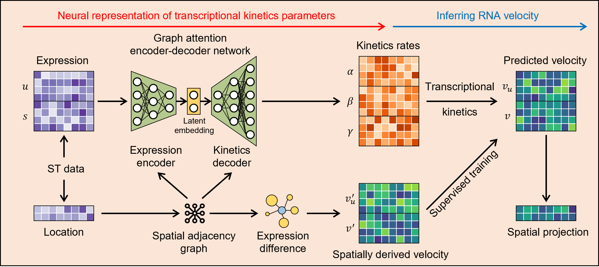

# STAVelo

## Overview
STAVelo is a deep learning method for inferring RNA velocity from spatial transcriptome data.



## installation
It is recommended to use a Python version  `3.9`.
* set up conda environment for STAVelo:
```
conda create -n STAVelo python==3.9
```
* activate STAVelo from shell:
```
conda activate STAVelo
```

* you can install the important Python packages used to run the model are as follows: 
```
pip install torch==2.0.0+cu117 torchvision==0.15.1+cu117 -f https://download.pytorch.org/whl/torch_stable.html
pip install torch-scatter torch-sparse torch-cluster torch-spline-conv torch-geometric -f https://data.pyg.org/whl/torch-2.0.0+cu117.html
```
Upgrading the versions of the Python packages mentioned above should not have a substantial impact on the results, but version compatibility should be noted.

Other important Python packages will be automatically installed in their specified versions during the installation process; upgrading their versions may result in errors.
* then you can download STAVelo from [github](https://github.com/zhanglabtools/STAVelo) and install STAVelo as follows:
```
cd STAVelo-main
pip install -e .
```

